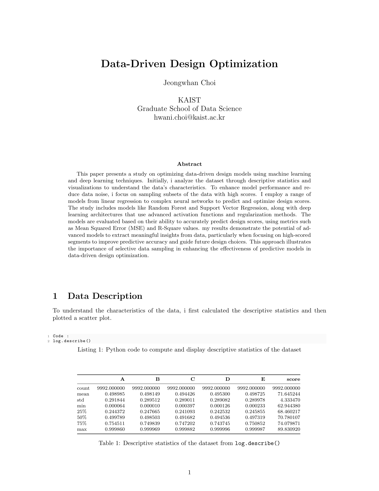
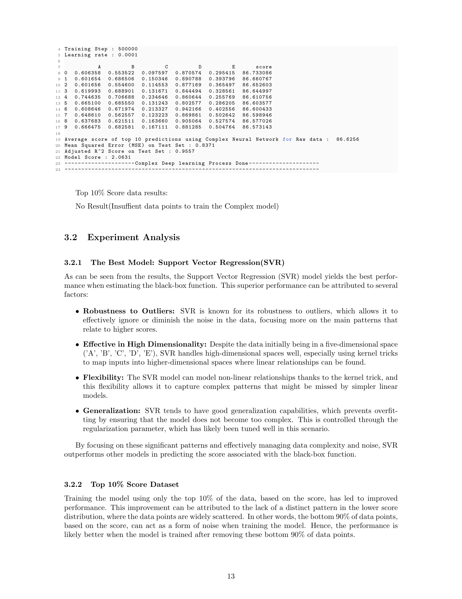
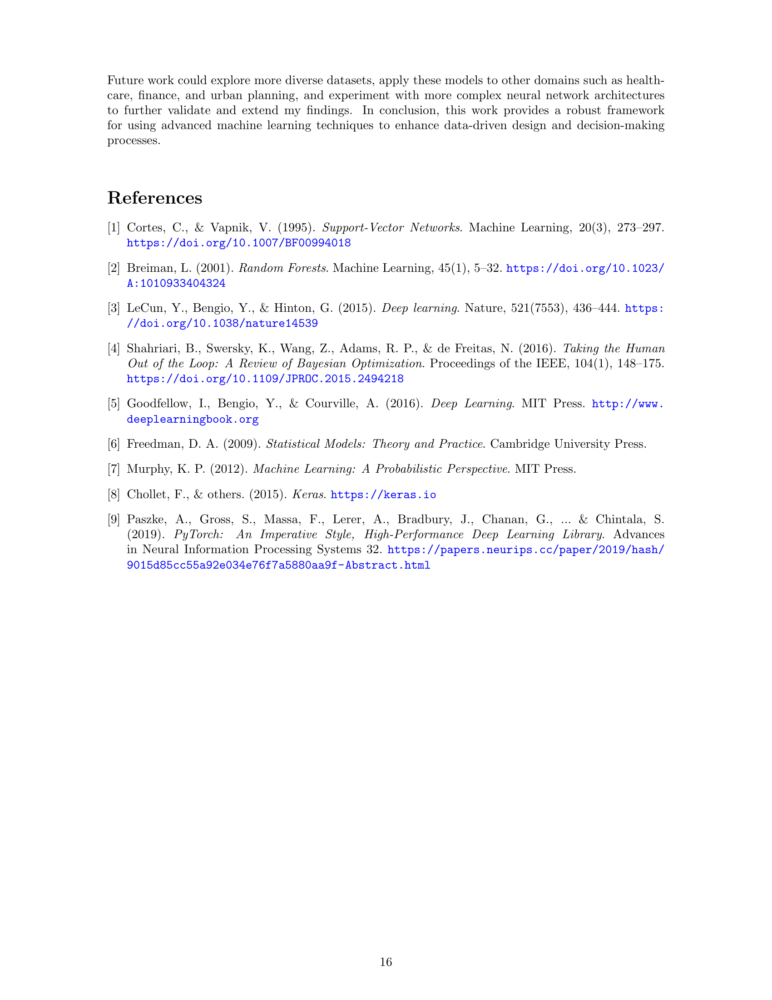

# Data-Driven Decision Making and Control Model Evaluation

[Data_Driven_Decision_Optimization.pdf](https://github.com/hwaaaaanii/Data-Driven-Decision-Optimization-Using-Bayesian-Optimization/files/15284006/Data_Driven_Decision_Optimization.pdf)

This project is part of the IE437 course on Data-Driven Decision Making and Control at KAIST. It includes a script, `main.py`, which evaluates various machine learning models on specified datasets to determine their performance and predict outcomes based on input features.

## Installation

Ensure you have Python 3.8+ installed on your system. You can download it from [Python's official website](https://www.python.org).

Then, install the required Python libraries

## Usage

The script main.py can be run from the command line with the following arguments:

-m or --models: Specify the model(s) to evaluate. Use all to evaluate all available models.
-o or --option: Specify the evaluation option(s). Use all to use all available options.

## Supported Models
- Linear Regression
- Random Forest
- SVR (Support Vector Regression)
- BaseNN (Basic Neural Network)
- ImprovedNN (Improved Neural Network)
- ComplexNN (Complex Neural Network)

## Options
- option1: Evaluate using the full dataset.
- ption2: Evaluate using the top 10% of the dataset based on the score.

## Command Line Examples
To run the script, use the following command:

python main.py -m <model_name> -o <option>

## Examples

Evaluate all models with option1
python main.py -m all -o option1

Evaluate the Linear Regression and SVR models with both option1 and option2
python main.py -m Linear Regression SVR -o option1 option2

Evaluate the Random Forest model with option2
python main.py -m Random Forest -o option2

