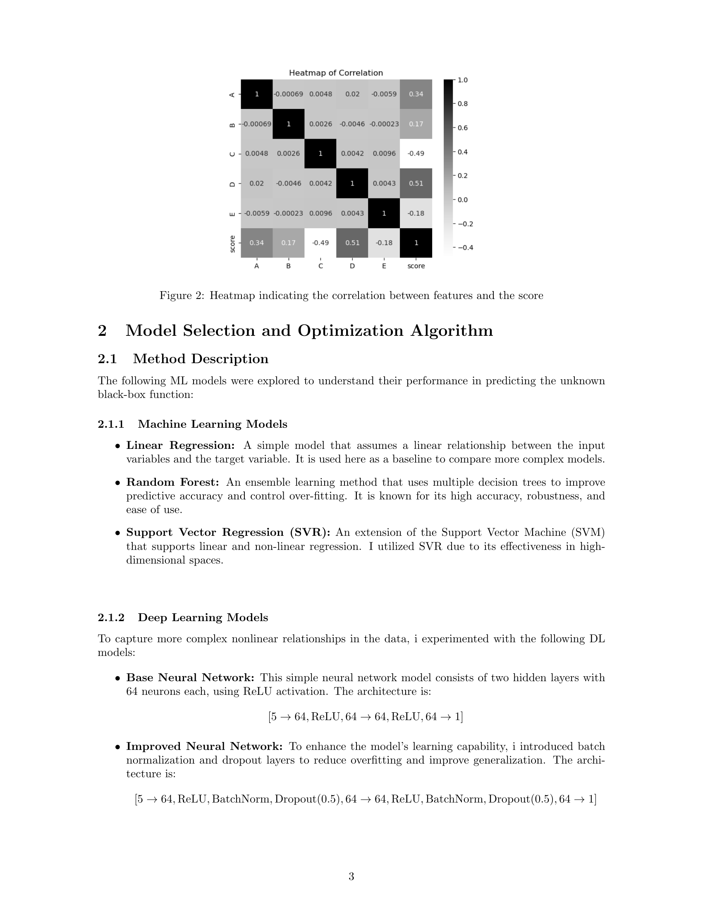
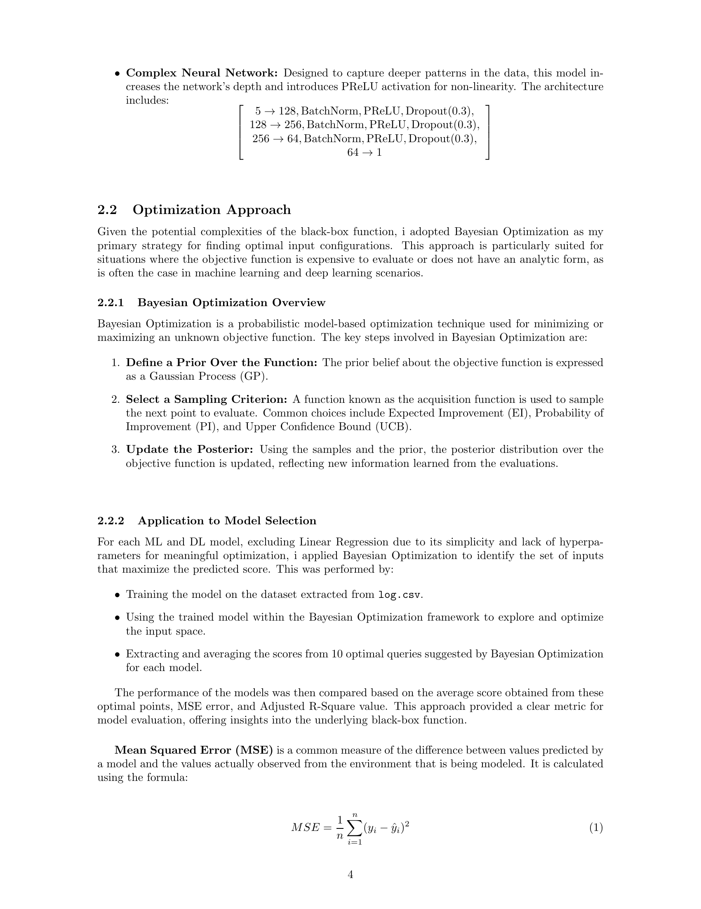
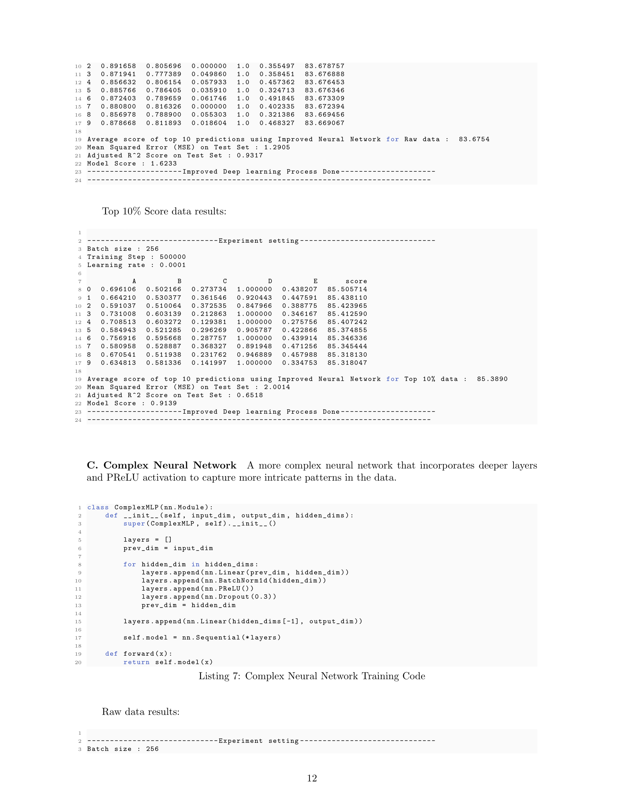
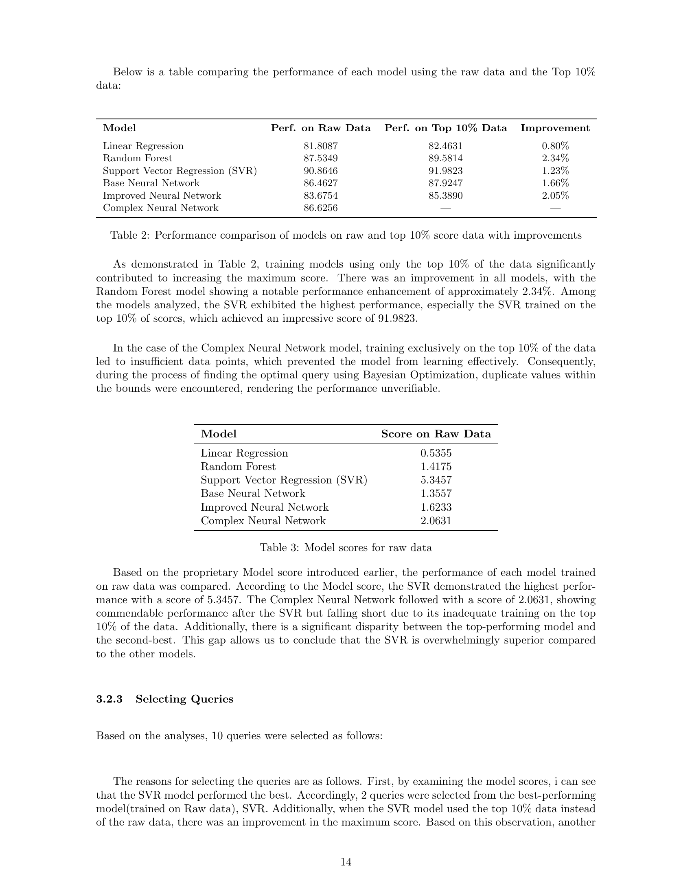
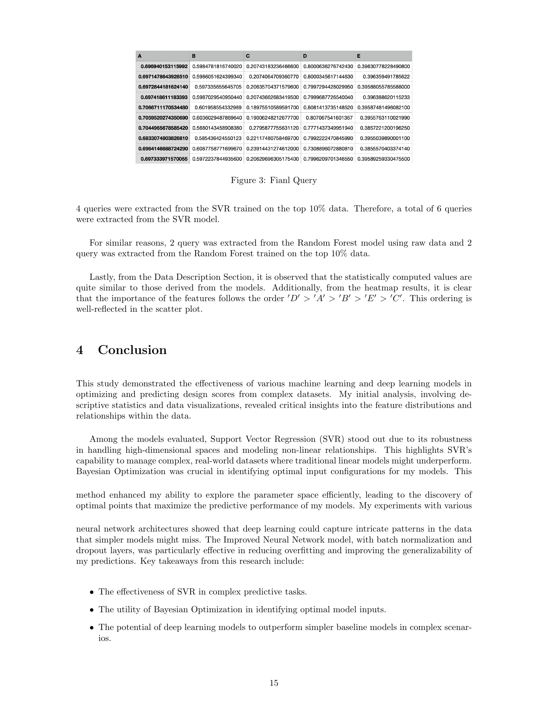

# Data-Driven Decision Making and Control Model Evaluation

This project is part of the IE437 course on Data-Driven Decision Making and Control at KAIST. It evaluates various machine learning models on specified datasets to determine their performance and predict outcomes based on input features.

## Project Documentation

For a detailed explanation of the project, refer to the paper linked below:

[Data-Driven Decision Optimization (PDF)](https://github.com/hwaaaaanii/Data-Driven-Decision-Optimization-Using-Bayesian-Optimization/files/15284006/Data_Driven_Decision_Optimization.pdf)

## Installation

Ensure you have Python 3.8+ installed on your system. You can download it from [Python's official website](https://www.python.org).


## Usage

You can run `main.py` from the command line with the following arguments:

- `-m` or `--models`: Specify the model(s) to evaluate. Use `all` to evaluate all available models.
- `-o` or `--option`: Specify the evaluation option(s). Use `all` to use all available options.

### Supported Models

- Linear Regression
- Random Forest
- SVR (Support Vector Regression)
- BaseNN (Basic Neural Network)
- ImprovedNN (Improved Neural Network)
- ComplexNN (Complex Neural Network)

### Options

- `option1`: Evaluate using the full dataset.
- `option2`: Evaluate using the top 10% of the dataset based on the score.

### Command Line Examples

To run the script, use the following commands:

```bash
# Evaluate all models with option1
python main.py -m all -o option1

# Evaluate the Linear Regression and SVR models with both option1 and option2
python main.py -m "Linear Regression" "SVR" -o option1 option2

# Evaluate the Random Forest model with option2
python main.py -m "Random Forest" -o option2
```

## Report

Below are some visualizations and outputs generated by the project scripts:

| Page | Image |
|------|-------|
| 1    |  |
| 2    |  |
| 3    |  |
| 4    |  |
| 5    |  |
| 6    |  |
| 7    |  |
| 8    |  |
| 9    |  |
| 10   |  |
| 11   |  |
| 12   |  |
| 13   |  |
| 14   |  |
| 15   |  |
| 16   |  |
